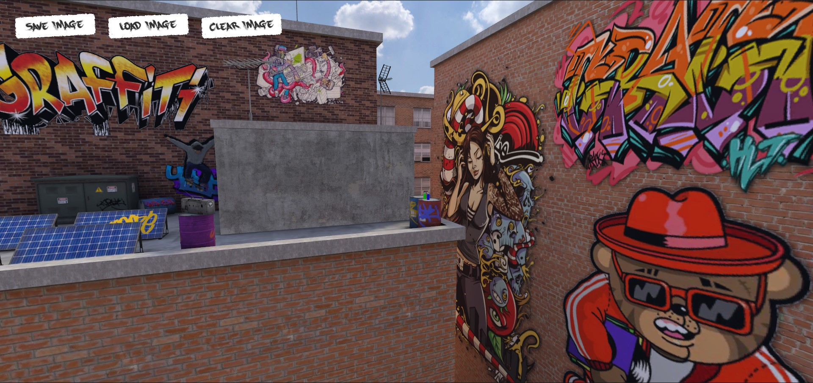
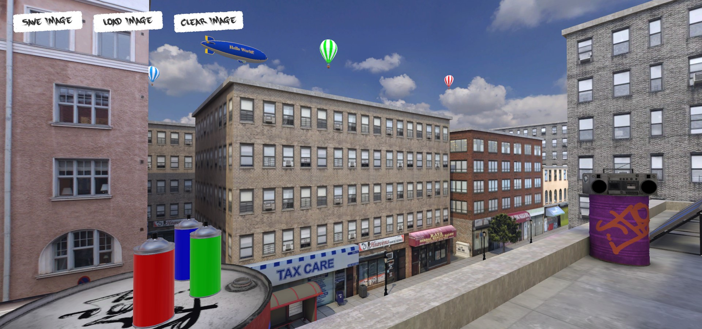
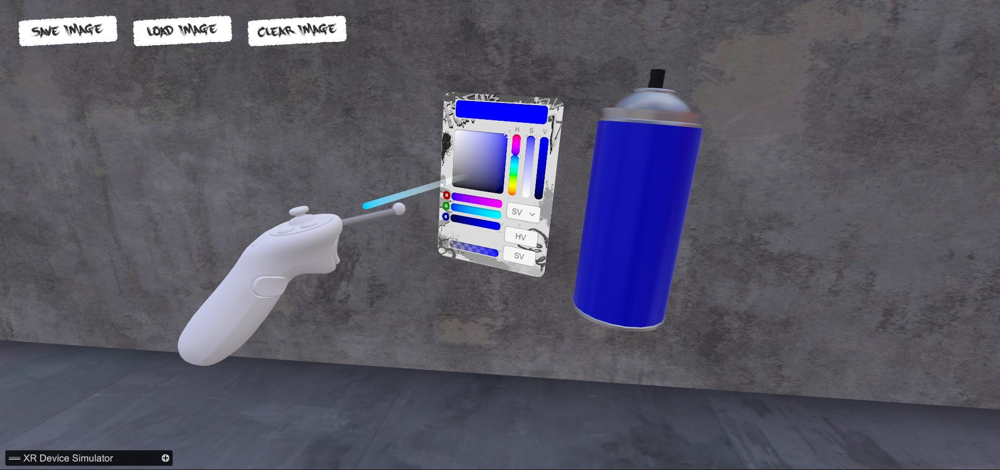
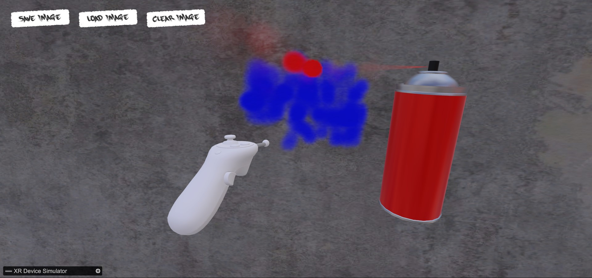
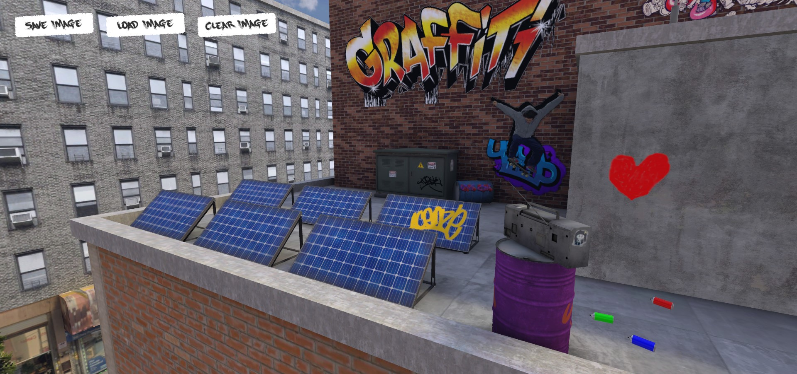

# Graffiti Drawing VR

## Description
- Unity version 2022.3.50f1

VR project to draw graffiti art using a spray can.

## Screenshots

## How to play

You can run the experience with the XR Device Simulator or with a VR Headset.
To run the app using the device simulator, please locate the `AppConfig` scriptable object in the project and check the corresponding field. Enter the play mode.

## Contributions

The main idea for drawing logic was taken from [this](https://github.com/sugi-cho/Unity-ProjectionSpray-v2) project.

### Plugins

| Plugin name            | Version      | Notes                                                                                                                |
|------------------------|--------------|----------------------------------------------------------------------------------------------------------------------|
| XR Interaction Toolkit | ver. 2.6.3   | [Link](https://docs.unity3d.com/Packages/com.unity.xr.interaction.toolkit@2.6/manual/index.html)                     |
| Open XR Plugin         | ver. 1.12.1  | [Link](https://docs.unity3d.com/Packages/com.unity.xr.openxr@1.12/manual/index.html)                                 |
| Universal RP           | ver. 14.0.11 | [Link](https://docs.unity3d.com/Packages/com.unity.render-pipelines.universal@14.0/manual/index.html)                |
| Input System           | ver. 1.11.0  | [Link](https://docs.unity3d.com/Packages/com.unity.inputsystem@1.11/manual/index.html)                               |
| DOTween                | ver. 1.2.765 | [Link](https://dotween.demigiant.com/documentation.php)                                                              |